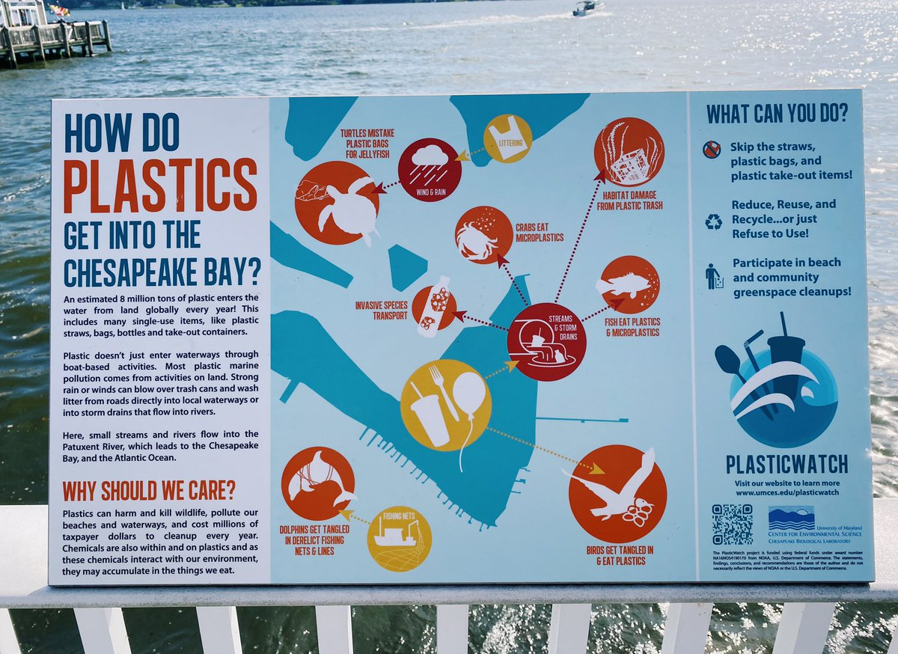
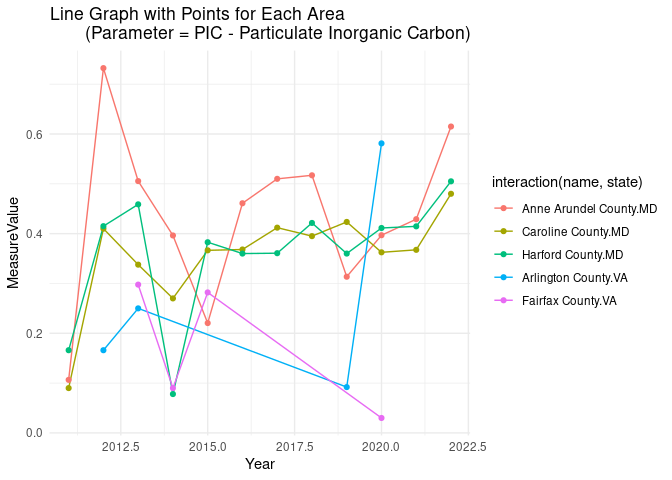
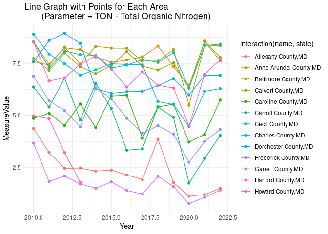
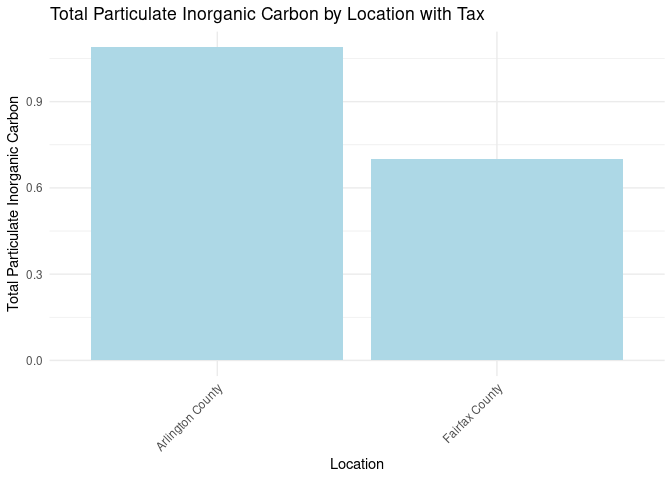
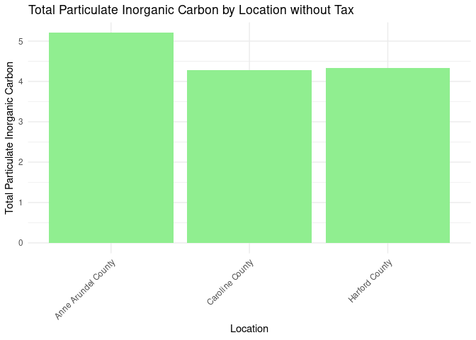
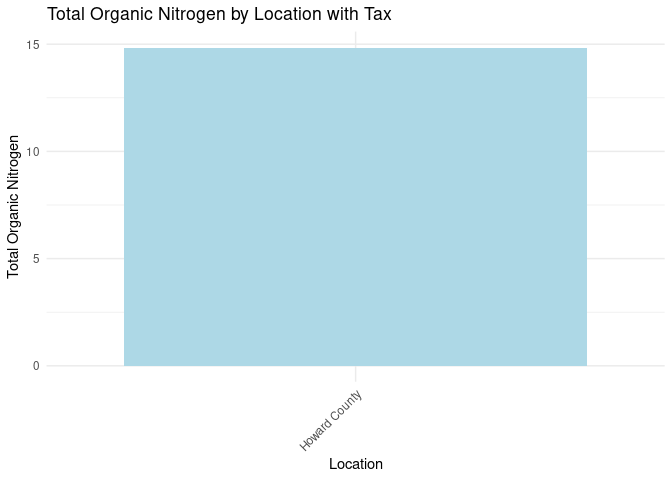
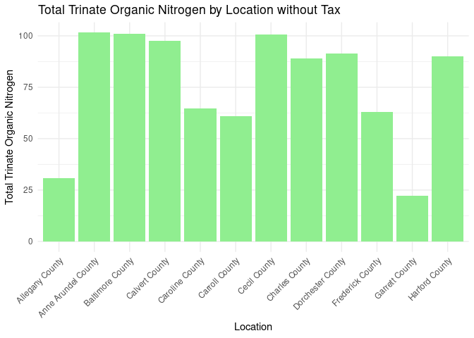

# Team Microplastic’s FIRE Summit Presentation

Sammi, Neha, Lasya, Sriya, Chayanika

## Research Question

What are the effects of the plastic bag ban on microplastic pollution in
the Chesapeake Bay?

``` r

```


## Data Wrangling

**Outcome variable**

Our outcome variable is water quality from each county adjacent to the
Chesapeake Bay. Specific water parameters that we are interested in
include total nitrogen, total carbon, and total organic nitrogen.

This data is obtained from
[https://datahub.chesapeakebay.net](https://datahub.chesapeakebay.net/)
which reports water quality from each county each day.

``` r
install.packages("tidyverse")
install.packages("terra")
install.packages("simplermarkdown")
install.packages("ggplot2")

library("tidyverse")
library("terra")
library("simplermarkdown")
library("ggplot2")

df<- read.csv("WaterQualityFIPS.csv") %>%
  rename(fips=FIPS)

fips<-read.csv("state_and_county_fips_master.csv")

dfcounty<-merge(df, fips, by="fips", all.x=TRUE) %>%
  mutate(SampleDate=as.Date(SampleDate, format='%m/%d/%Y')) %>%
  mutate(Month=month(SampleDate), Year=year(SampleDate)) %>%
  group_by(Parameter, Unit, fips, name, state, Month, Year) %>%
  summarize(MeasureValue=mean(MeasureValue))
head(dfcounty)
```

    # A tibble: 6 × 8
    # Groups:   Parameter, Unit, fips, name, state, Month [1]
      Parameter Unit   fips name                state Month  Year MeasureValue
      <chr>     <chr> <int> <chr>               <chr> <dbl> <dbl>        <dbl>
    1 PIC       MG/L  24003 Anne Arundel County MD        1  2012        0.03 
    2 PIC       MG/L  24003 Anne Arundel County MD        1  2013        0.03 
    3 PIC       MG/L  24003 Anne Arundel County MD        1  2014        0.03 
    4 PIC       MG/L  24003 Anne Arundel County MD        1  2017        0.114
    5 PIC       MG/L  24003 Anne Arundel County MD        1  2018        0.03 
    6 PIC       MG/L  24003 Anne Arundel County MD        1  2020        0.03 

**Treatment variable**

Our treatment variable is an indicator of whether there is a plastic bag
ban or tax in each county. This data set came
from <https://www.bagtheban.com/in-your-state/>.

``` r
library("tidyverse")
library("terra")
library("simplermarkdown")

df2<- read.csv("PlasticBagLegislation.csv") %>%
  rename(name=Location) %>%
  rename(state=State) %>%
  mutate(state=ifelse(state=="Maryland", "MD", "VA")) %>%
  mutate(monthBan=ifelse(Ban==1, Month, "N/A")) %>%
  mutate(yearBan=ifelse(Ban==1, Year, "N/A")) %>%
  mutate(monthTax=ifelse(Tax==1, Month, "N/A")) %>%
  mutate(yearTax=ifelse(Tax==1, Year, "N/A"))
```

**Control variables**

``` r
cmd<-vect("Shapefiles/tl_2020_24_county10.shp")
cva<-vect("Shapefiles/tl_2020_51_county10.shp")

r<-rast("201001.nc4")
rp<-project(r[[1]], crs(cmd))

plot(rp)
plot(cmd, add=TRUE)
plot(cva, add=TRUE)
```


To take into account total precipitation and average storm-water runoff
data we used data from NASA Earth Data. Our data came from GLDAS NOAA
Land Surface Model.

## Preliminary Results

``` r
df3<- read.csv("PlasticBagLegislation.csv") %>%
  rename(name=Location) %>%
  rename(state=State) %>%
  mutate(state=ifelse(state=="Maryland", "MD", "VA")) 

df4<-df3 %>%
  mutate(monthBan=ifelse(Ban==1, Month, NA)) %>%
  mutate(yearBan=ifelse(Ban==1, Year, NA)) %>%
  mutate(monthTax=ifelse(Tax==1, Month, NA)) %>%
  mutate(yearTax=ifelse(Tax==1, Year, NA)) 

df4<-df4[,-1:-4]

df4county<-merge(df4, dfcounty, by=c("name", "state"), all.y=TRUE) %>%
  mutate(monthBan = ifelse(monthBan=="January", 1, 
                    ifelse(monthBan=="February", 2, 
                    ifelse(monthBan=="March", 3, 
                    ifelse(monthBan=="April", 4, 
                    ifelse(monthBan=="May", 5, 
                    ifelse(monthBan=="June", 6, 
                    ifelse(monthBan=="July", 7,
                    ifelse(monthBan=="August", 8,
                    ifelse(monthBan=="September", 9, 
                    ifelse(monthBan=="October", 10, 
                    ifelse(monthBan=="November", 11, 
                    ifelse(monthBan=="December", 12, NA))))))))))))) %>%
  mutate(monthTax = ifelse(monthTax=="January", 1, 
                    ifelse(monthTax=="February", 2, 
                    ifelse(monthTax=="March", 3, 
                    ifelse(monthTax=="April", 4, 
                    ifelse(monthTax=="May", 5, 
                    ifelse(monthTax=="June", 6, 
                    ifelse(monthTax=="July", 7,
                    ifelse(monthTax=="August", 8,
                    ifelse(monthTax=="September", 9, 
                    ifelse(monthTax=="October", 10, 
                    ifelse(monthTax=="November", 11, 
                    ifelse(monthTax=="December", 12, NA))))))))))))) %>%
  mutate(Ban = ifelse((Year > yearBan), 1, 0)) %>%
  mutate(Ban = ifelse((Year == yearBan & Month>monthBan), 1, Ban)) %>%
  mutate(Tax = ifelse((Year > yearTax), 1, 0)) %>%
  mutate(Tax = ifelse((Year == yearTax & Month>monthTax), 1, Tax))

md_nasa_data <- read.csv("md_nasa_data.csv")
va_nasa_data <- read.csv("va_nasa_data.csv")

#Renaming the names column in order to merge the datasets
md_nasa_data <- md_nasa_data %>%
  rename(name = NAMELSAD10)

va_nasa_data <- va_nasa_data %>%
  rename(name = NAMELSAD10)

# Merging with state_and_county_fips_master to get the state column
md_nasa <- merge(md_nasa_data, fips, by.x = "name")

va_nasa <- merge(va_nasa_data, fips, by.x = "name")

# Creating the month column using the file column
md_nasa <- md_nasa %>%
  mutate(Month = as.numeric(substr((md_nasa$file),5,6)))
va_nasa <- va_nasa %>%
  mutate(Month = as.numeric(substr((va_nasa$file),5,6)))

# Creating the year column
md_nasa <- md_nasa %>%
  mutate(Year = as.numeric(substr((md_nasa$file),1,4)))
va_nasa <- va_nasa %>%
  mutate(Year = as.numeric(substr((va_nasa$file),1,4)))

# Combining va_nasa and md_nasa
all <- rbind(md_nasa, va_nasa)

finaldf <- merge(df4county, all, by=c("name","state", "Month", "Year", "fips"), all.x = TRUE) %>%
  filter(!is.na(Evap_tavg)) %>%
  filter(!is.na(Qs_tavg)) %>%
  filter(!is.na(Rainf_f_tavg)) %>%
  filter(!is.na(Tair_f_tavg))
```

START OF GRAPHS

``` r
# Filter the data frame to only include rows where Parameter = "PIC"
dfcountyPIC <- dfcounty[dfcounty$Parameter == "PIC", ]
# Create a summary data table with the total sum of MeasureValue for each location
year_sum_PIC <- aggregate(MeasureValue ~ Year + name + state, data = dfcountyPIC, sum)


# Create a line graph with points for all areas
ggplot(year_sum_PIC, aes(x = Year, y = MeasureValue, group = interaction(name, state), color = interaction(name, state))) +
  geom_line() +
  geom_point() +
  theme_minimal() +
  labs(title = "Line Graph with Points for Each Area 
       (Parameter = PIC - Particulate Inorganic Carbon)",
       x = "Year",
       y = "MeasureValue")
```



``` r
# Filter the data frame to only include rows where Parameter = "TON"
dfcountyTON <- dfcounty[dfcounty$Parameter == "TON", ]
# Create a summary data table with the total sum of MeasureValue for each location
year_sum_TON <- aggregate(MeasureValue ~ Year + name + state, data = dfcountyTON, sum)


# Create a line graph with points for all areas
ggplot(year_sum_TON, aes(x = Year, y = MeasureValue, group = interaction(name, state), color = interaction(name, state))) +
  geom_line() +
  geom_point() +
  theme_minimal() +
  labs(title = "Line Graph with Points for Each Area 
       (Parameter = TON - Total Organic Nitrogen)",
       x = "Year",
       y = "MeasureValue")
```



``` r
# Data frame with locations that only have a Tax and appear on DataHub
tax_and_data <- df3[df3$Tax == 1 & df3$DataHubPresence == 1,]
tax_and_data
```

         Month Year Ban Tax                name state DataHubPresence
    1  October 2021   1   1      Baltimore City    MD               1
    3     July 2020   0   1       Howard County    MD               1
    7  January 2012   0   1   Montgomery County    MD               1
    9  January 2023   0   1    Albemarle County    VA               1
    10    July 2022   0   1       Louden County    VA               1
    13 January 2022   0   1    Arlington County    VA               1
    14 January 2022   0   1     Alexandria City    VA               1
    15 January 2022   0   1      Fairfax County    VA               1
    16 January 2022   0   1 Fredericksburg City    VA               1
       SurroundingTheBay
    1                  1
    3                  0
    7                  0
    9                  0
    10                 0
    13                 1
    14                 1
    15                 1
    16                 0

``` r
# Merge dfcounty with locations that corresponds with those in tax_and_data
tax_data <- dfcounty %>%
  inner_join(tax_and_data, by = c("name", "state"))
# Remove unnecessary columns
tax_data <- tax_data[-c(3, 6:7, 9:11)]
```

``` r
# Data frame that stores Particulate Inorganic Carbon(PIC) from areas with Tax 
tax_carbon <- tax_data %>%
  filter(Parameter == "PIC")

# Data frame that contains the total sum of PIC for each location
tax_carbon_location_sum <- tax_carbon %>%
  group_by(name) %>%
  summarize(TotalMeasureValue = sum(MeasureValue, na.rm = TRUE))
  print(tax_carbon_location_sum)
```

    # A tibble: 2 × 2
      name             TotalMeasureValue
      <chr>                        <dbl>
    1 Arlington County             1.09 
    2 Fairfax County               0.700

``` r
# Graph tax and carbon data
library(ggplot2)

ggplot(tax_carbon_location_sum, aes(x = name, y = TotalMeasureValue)) +
  geom_bar(stat = "identity", fill = "lightblue") +
  labs(title = "Total Particulate Inorganic Carbon by Location with Tax",
       y = "Total Particulate Inorganic Carbon",
       x = "Location") +
  theme_minimal() +
  theme(axis.text.x = element_text(angle = 45, hjust = 1)) 
```



``` r
# Data frame with areas that have no Tax and are on DataHub
no_tax_data <- df3[df3$Tax == 0 & df3$DataHubPresence == 1,]

# Merge dfcounty with locations that corresponds with those in no_tax_and_data
no_tax_data <- dfcounty %>%
  inner_join(no_tax_data, by = c("name", "state"))
# Remove unnecessary columns
no_tax_data <- no_tax_data[-c(3, 6:7, 9:11)]
```

``` r
# Data frame that stores Particulate Inorganic Carbon(PIC) from areas without Tax 
no_tax_carbon <- no_tax_data %>%
  filter(Parameter == "PIC")
# Data frame that contains the total sum of PIC for each location
no_tax_carbon_location_sum <- no_tax_carbon %>%
  group_by(name) %>%
  summarize(TotalMeasureValue = sum(MeasureValue, na.rm = TRUE))
```

``` r
# Graph no tax and carbon data
ggplot(no_tax_carbon_location_sum, aes(x = name, y = TotalMeasureValue)) +
  geom_bar(stat = "identity", fill = "lightgreen") +
  labs(title = "Total Particulate Inorganic Carbon by Location without Tax",
       y = "Total Particulate Inorganic Carbon",
       x = "Location") +
  theme_minimal() +
  theme(axis.text.x = element_text(angle = 45, hjust = 1))
```



``` r
# Data frame that stores Total Organic Nitrate(TON) from areas with Tax 
tax_nitrogen <- tax_data %>%
  filter(Parameter == "TON")

# Data frame that contains the total sum of TON for each location
tax_nitrogen_location_sum <- tax_nitrogen %>%
  group_by(name) %>%
  summarize(TotalMeasureValue = sum(MeasureValue, na.rm = TRUE))
```

``` r
# Graph tax and carbon data
ggplot(tax_nitrogen_location_sum, aes(x = name, y = TotalMeasureValue)) +
  geom_bar(stat = "identity", fill = "lightblue") +
  labs(title = "Total Organic Nitrogen by Location with Tax",
       y = "Total Organic Nitrogen",
       x = "Location") +
  theme_minimal() +
  theme(axis.text.x = element_text(angle = 45, hjust = 1)) 
```



``` r
# Data frame that stores Total Organic Nitrate(TON) from areas without Tax 
no_tax_nitrogen <- no_tax_data %>%
  filter(Parameter == "TON")

# Data frame that contains the total sum of TON for each location
no_tax_nitrogen_location_sum <- no_tax_nitrogen %>%
  group_by(name) %>%
  summarize(TotalMeasureValue2 = sum(MeasureValue, na.rm = TRUE))
```

``` r
# Graph no tax and nitrogen data
ggplot(no_tax_nitrogen_location_sum, aes(x = name, y = TotalMeasureValue2)) +
  geom_bar(stat = "identity", fill = "lightgreen") +
  labs(title = "Total Trinate Organic Nitrogen by Location without Tax",
       y = "Total Trinate Organic Nitrogen",
       x = "Location") +
  theme_minimal() +
  theme(axis.text.x = element_text(angle = 45, hjust = 1))
```


